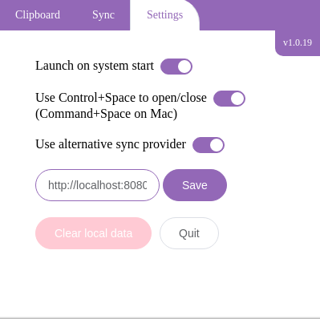

# Clipr Sync Provider
> Clipr Sync provider implementation

Alternative sync provider for clipr.
Can be installed on your server or your local network to be used instead of the built-in sync service.


## Installation

* Clone the repo
* Make sure [docker](https://www.docker.com/) and [docker-compose](https://docs.docker.com/compose/) is installed
* edit `docker-compose.yml` to change the couchDB credentials and/or the listening ports
* In the cloned directory run:
```sh
docker-compose up
```

## Usage

After the service is built and started you can point your clipr installation to it by enabling
the **use alternative sync provider** in the settings tab and adding your installation's url.



## Meta

[https://clipr.cloud](https://clipr.cloud) – hello@clipr.cloud

Distributed under the AGPL-3.0 license. See ``LICENSE`` for more information.

[https://github.com/clipr](https://github.com/clipr/)

## Contributing

1. Fork it (<https://github.com/clipr/sync-provider/fork>)
2. Create your feature branch (`git checkout -b feature/fooBar`)
3. Commit your changes (`git commit -am 'Add some fooBar'`)
4. Push to the branch (`git push origin feature/fooBar`)
5. Create a new Pull Request
